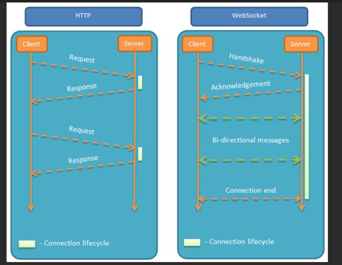
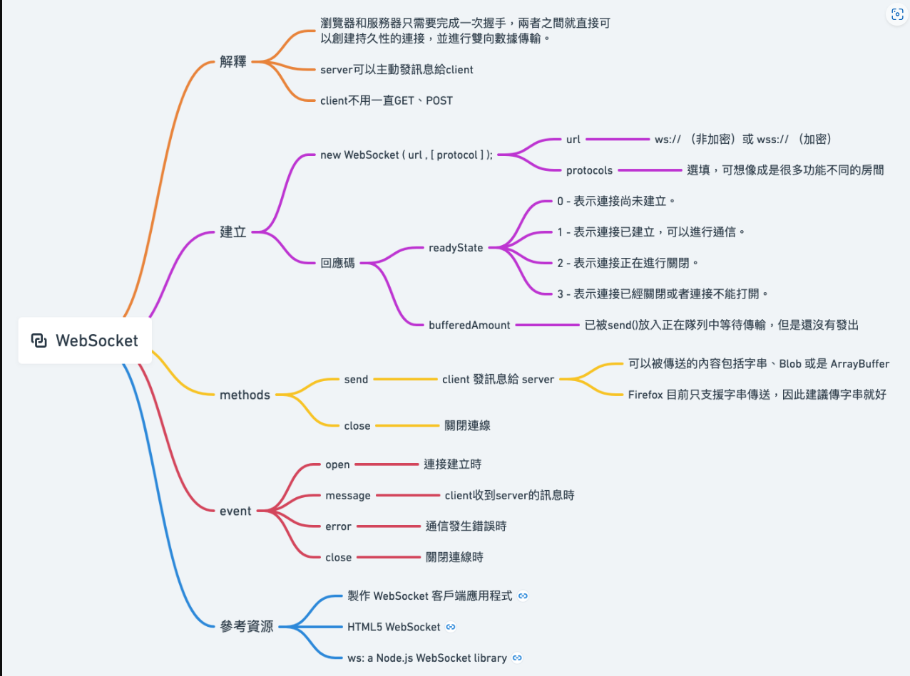
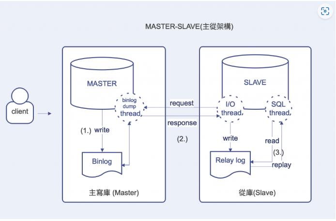
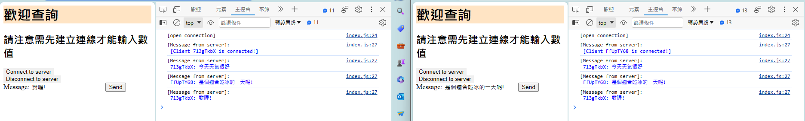
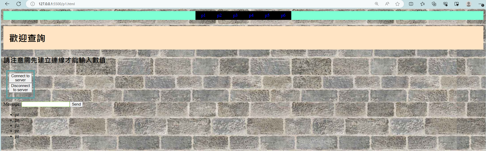

# 使用websocket觀念


## 這是關於websocket的架構圖


## 主從架構

所有寫入更新異動操作皆由主庫(Master)執行，而讀取相關的撈資料語法轉至從庫(Slave)執行。不但能分散單點在大量負載請求下的壓力，也能避免部分長時間語法造成表鎖導致無法正常使用服務的問題。如遇到故障時可以透過切換節點，直接取代掉有問題的那台上線運作。

## 即時聊天室



當server port打開時才能夠去client端開啟頁面打開介面後按下conncet按鈕系統傳送一個id，並會顯示

[Client [id] is connected!]  這時就可以輸入要輸入的內容
此時再開啟另個分頁執行一樣的步驟此時再輸入訊息就能

發現兩邊的對話視窗能夠同步運行

## server端程式
```bash
// import library
const express = require('express') //呼叫express函數
const ServerSocket = require('ws').Server   // 引用 Server

const PORT = 8080

// 建立 express 物件並用來監聽 8080 port
const server = express()
    .listen(PORT, () => console.log(`[Server] Listening on https://localhost:${PORT}`))

// 建立實體，透過 ServerSocket 開啟 WebSocket 的服務
const wss = new ServerSocket({ server })

//連結wss時要處理ws跟req
wss.on('connection', (ws, req) => {
// 開啟連結並向websocket取得id後系統會顯是client [id] is connected
    ws.id = req.headers['sec-websocket-key'].substring(0, 8)
    ws.send(`[Client ${ws.id} is connected!]`)

    // Listen for messages from client
    ws.on('message', data => {
        console.log('[Message from client] data: ', data)
        // Get clients who has connected
        let clients = wss.clients
        // //對每個客戶端的發言傳送${ws,id}加上傳送的內容
        clients.forEach(client => {
            client.send(`${ws.id}: ` + data)
        })
    })

    // Connection closed
    ws.on('close', () => {
        console.log('[Close connected]')
    })
})
// //用來import
// const express = require('express')//call express
// const ServerSocket =require('ws').Server//引用Server

// const Port= 8080
// //建立express物件並監聽8080Port
// const server =express()
// //Port會被放在${Port}裡面再console會顯示裡面的文字
// .listen(Port,() =>console.log(`[Server] listen on https://localhost:${Port}`))
// //建立實體，透過Serversocket來開啟websocket
// const wss =new ServerSocket({server})
// //連結wss時要處理ws跟req
// wss.on=('connection',(ws,req)=>{
//     //取得各個使用者獨一無二的識別證，透過這些識別證，又能夠對照到我們所熟悉的遊戲 ID 或是帳號。
//     ws.id=req.headers['sec-websocket-key'].substring(0,8)
//     ws.send(`[client $(ws.id) is conected!]`)
//     console.log=('[client connect]')

//     ws.on=('message',data =>{
//         console.log('[Message from client] data',data)
//         let clients = wss.clients
//         //對每個客戶端的發言傳送${ws,id}加上傳送的內容
//         clients.foreach(client=>{
//             client.send(`${ws,id}:`+ data)
//         })
//     })
// //ws關閉顯示close
//     ws.on=('close',()=>{
//         console.log=('[client close]')
//  })
// })
```
---
## client端程式

```bash
var ws

// 監聽 click 事件
document.querySelector('#connect')?.addEventListener('click', (e) => {
    connect()
})

document.querySelector('#disconnect')?.addEventListener('click', (e) => {
    disconnect()
})

document.querySelector('#sendBtn')?.addEventListener('click', (e) => {
    const msg = document.querySelector('#sendMsg')
    sendMessage(msg?.value)
})

function connect() { 
    // Create WebSocket connection
    ws = new WebSocket('ws://localhost:8080') 
    
    // ws = new WebSocket('ws://192.168.17.35:58095') 
    // 在開啟連線時執行
    ws.onopen = () => {
        console.log('[open connection]')
        // Listen for messages from Server
        ws.onmessage = event => {
            console.log(`[Message from server]:\n %c${event.data}` , 'color: blue')
        }
    }
}

function sendMessage(msg) {
    // Send messages to Server
    ws.send(msg)
}

function disconnect() {
    ws.close()
    // 在關閉連線時執行
    ws.onclose = () => console.log('[close connection]')
}
```


### 由server傳送當前時間給client

```bash
//import express 和 ws 套件
const express = require('express')
const SocketServer = require('ws').Server

//指定開啟的 port
const PORT = 3000

//創建 express 的物件，並綁定及監聽 3000 port ，且設定開啟後在 console 中提示
const server = express()
    .listen(PORT, () => console.log(`Listening on ${PORT}`))

//將 express 交給 SocketServer 開啟 WebSocket 的服務
const wss = new SocketServer({ server })

//當 WebSocket 從外部連結時執行
wss.on('connection', ws => {

    //連結時執行此 console 提示
    console.log('Client connected')

    //固定送最新時間給 Client  setInterval() 方法可按照指定的周期（以毫秒计）来调用函数或计算表达式
    const sendNowTime = setInterval(()=>{
        ws.send(String(new Date()))
    },1000)
    //對 message 設定監聽，接收從 Client 發送的訊息
    ws.on('message', data => {
         //data 為 Client 發送的訊息，現在將訊息原封不動發送出去
        ws.send(data)
    })
    //當 WebSocket 的連線關閉時執行
    ws.on('close', () => {
        //連線中斷時停止 setInterval
        clearInterval(sendNowTime)
        console.log('Close connected')
    })
})
#執行 node 檔案名稱
```
## 製作client端時須先設置UI介面最後再把js給放回去
http-server -p [port]來連線
還需要下載 ws express http-server這三個都使用npm install 因為都在node.js底下
## WebSocket觀念
在WebSocket中，只需要伺服器和瀏覽器通過HTTP協定進行一個握手的動作，然後單獨建立一條TCP的通訊通道進行資料的傳送。此方式可以解決http的缺點且不會浪費支援和時間，因為只要經過一次同意後，傳送資料就不用每次都請求了。WobSocket還有一個優點就是它採取非同步的方式觸發這樣不會堵塞UI，減少響應時間也可以讓使用者有更好的體驗。
### WebSocket API
new WebSocket()：和 Server 建立 WebSocket 連線
 ### WebSocket Event分為四種
open：成功和 Server 建立連線時觸發
</br>message：接收到 Server 端訊息時觸發
</br>close：關閉連線時觸發
</br>error：連線發生錯誤時觸發
### WebSocket Methods  
send()：發送訊息給 Server
close()：關閉連線


## 自動調整照片位置
 ```bash
 <!DOCTYPE html>
<html lang="en">
<head>
    <meta charset="UTF-8">
    <meta name="viewport" content="width=device-width, initial-scale=1.0">
    <meta http-equiv="X-UA-Compatible"
    content="ie=edge">
    <title>Document</title>
    #匯入reset的css檔
    <link rel="stylesheet" href="reset.css">
    <style>
    # .是因為這些都在class中
        .wrap{
            width: 960px;
            margin: auto;
            display: flex;
        }
        .item{
             width: 100%;
             #代表 上 右左 下 的意思
             margin: 0 10px 10px;
        }
        .item img{
            width: 100%;
            # vertical-align(對齊)最大的一個特性是，只適用於行內元素(inline)，也就是只適用於預設為display:inline的元素。
            vertical-align: top;
        }
    </style>
</head>


<body>
    <div class="wrap">
        <div class="item">
            
        </div>
        <div class="item">
            
        </div>
        <div class="item">
            
        </div>
    </div>
        
        
        
    <div class="wrap">
        <div class="item">
             
        </div>
        <div class="item">
            
        </div>
        <div class="item">
             
        </div>
    </div>        


    <div class="wrap">
        <div class="item">
             
        </div>
        <div class="item">
            
        </div>
    </div>
</body>


</html>
 ```
 
 
 
 ## 嘗試設計UI介面
 ```bash
 <html>
    <head>
        <meta charset="utf-8"/>
        <title>資料查詢系統</title>
        <link rel="stylesheet"href="style.css"></link>
    </head>
    <body style="background-image:url(pexels-photo-220182.jpeg);">
        <nav>
            <a href="p1.html">p1</a>
            <a href="p2.html">p2</a>
            <a href="p3.html">p3</a>
            <a href="p4.html">p4</a>
            <a href="p5.html">p5</a>
            <a href="p6.html">p6</a>
        </nav>
        
        <h1 style="background-color: bisque; padding: 20px ;  justify-content:center;">歡迎查詢</h1>
        <h2 style="justify-content:centers">請注意需先建立連線才能輸入數值</h2>
        <!-- Connect or Disconnect WebSocket Server -->
        <div class="function">
            <button id="connect" >Connect to server</button>
            </br>
            <button id="disconnect">Disconnect to server</button>
        </div>
            <!-- Send Message to Server -->
        <div>
            Message: <input style="border:1px dashed chartreuse;" type="text" id="sendMsg" ><button id="sendBtn">Send</button>
        </div>
        <div>
            <ul>
                <li>pz</li>
                <li>pz</li>
                <li>pz</li>
                <li>pz</li>
                <li>pz</li>
            </ul> 
        </div>
        

            <!-- Import index.js after UI rendered -->
            <script src='./index.js'></script>
            
    </body>
</html>
 ```
 

 ## 目前進度
 <ol>
    <li>在查找如何把溫度計的資料回傳到server</li>
    <li>嘗試多動手去寫程式以此熟悉該從何下手</li>
    <li>目前腦中有些想法但還不知該如何做出來，就是要分成兩段一段是client向server請求資料然後server把值回傳，還有一段是server要把RTU傳回來的數值給記錄下來但這段卡住了</li>
 </ol>


 

 這張是只要我點下一次connect鍵我就能讓sever的值一直回傳，然後我覺得跟讀取RTU的方式有點類似。在思考能不能拿來運用。